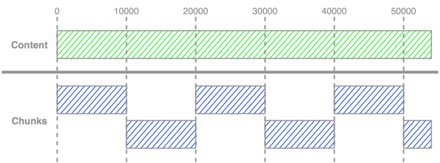

# Chunking

Chunking can be thought of as the opposite of batching, and describes the process of breaking down a large input into multiple smaller pieces, referred to as chunks. Once again taking a real example, imagine you are eating a steak. The steak is too large to eat in a single mouthful, so instead you cut it into multiple pieces and eat a single piece at a time.

Returning to the context of LLMs, models have input token limits, which restrict the amount of data that can injested in a single API call, so developers must be aware of the amount of content being transmitted to the model. Chunking provides a way for developers to process content that exceeds the input limits of a model.

In error-prone situations, chunking can be especially useful because if an error occurs, only the individual chunk needs to be reprocessed, rather than the entire input, which can be signifcantly quicker.

There are various different methods of chunking, which can also be combined with batching techniques, with each performing better depending on the media type and use case. In this section we will begin by covering the two simplest techniques, fixed chunking and sliding window chunking.

## Examples

[Google Collab Link]

In the following examples, we use an sample content containing ~54000 characters, which is significantly lower than the input token limit of current state-of-the-art models. However, for the purpose of these exanples, we will assume an input token limit that effectively restricts us to 10,000 characters.

### 1. Fixed Chunking

In fixed chunking, the content is split into non-overlapping chunks each containing a set number of characters, in this case 10,000. 

```python
chunk_char_size = 10000
chunked_content = []
chunk_count = math.ceil(len(content) / chunk_char_size)

for i in range(chunk_count):
    chunk_start_pos = i * chunk_char_size
    chunk_end_pos = min(chunk_start_pos + chunk_char_size, len(content))
    chunked_content.append(content[chunk_start_pos : chunk_end_pos])

print(f'Number of chunks: {len(chunked_content)}')
```

### 2. Sliding Window Chunking

```python
chunk_char_size = 10000
window_char_size = 2500

chunked_content = []
chunk_count = math.ceil(len(content) / (chunk_char_size - window_char_size))

for i in range(chunk_count):
    chunk_start_pos = i * (chunk_char_size - window_char_size)
    chunk_end_pos = min(chunk_start_pos + chunk_char_size, len(content))
    chunked_content.append(content[chunk_start_pos : chunk_end_pos])

print(f'Number of chunks: {len(chunked_content)}')
```